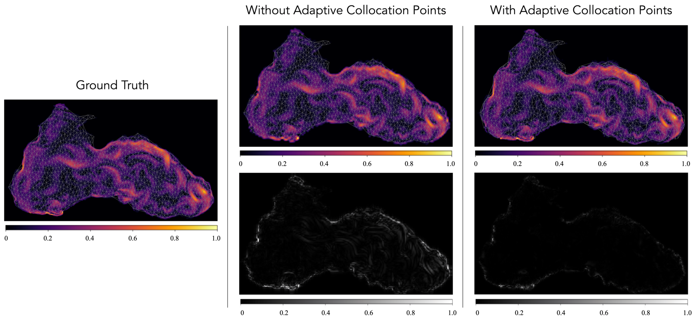
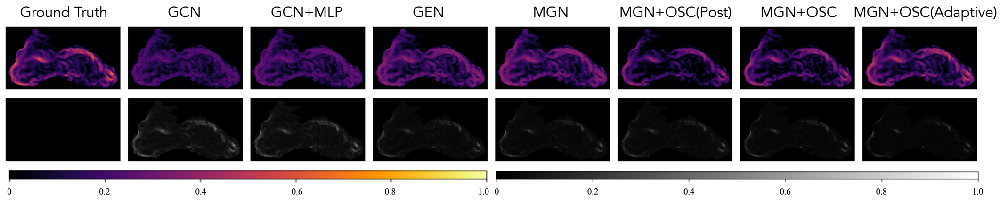
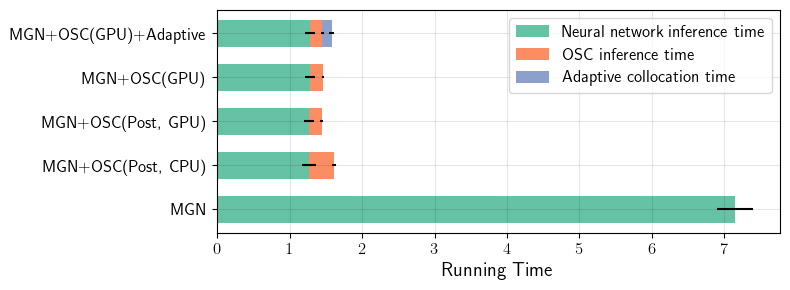
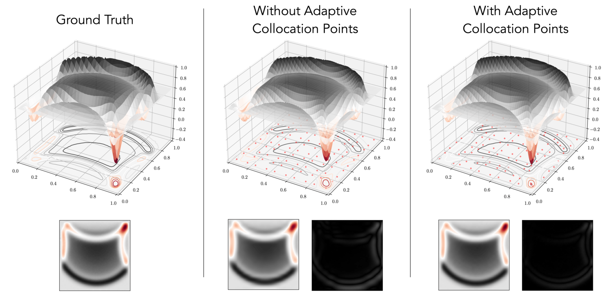
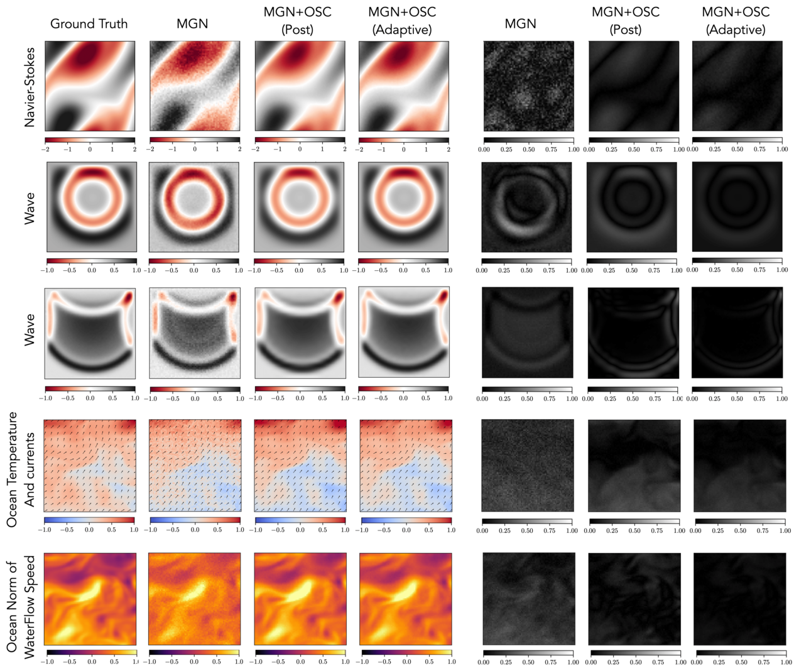

# GraphSplineNets 

## Black Sea Experiment

We include in this file the additional experimental details for the new Black Sea forecasting dataset.

### Dataset Details
The Black Sea dataset is composed of daily real-world measurements of ocean currents. The resolution of the raw data is 1/27° x 1/36°. We employ data starting from 01/01/2012 until 01/01/2020; we split training, validation and testing with ratios of 5:1:1 as in the other datasets in the paper sequentially on the temporal axis; i.e., so that the model has not seen data from 2018 or 2019 during training. Of the datapoints in the grids, less than 50% actually cover the Black Sea due to the irregular shape of the sea. To obtain a mesh, we subsample the grid using Delaunay triangulation to 5000 nodes for baselines and 1000 nodes for GraphSplineNets, which result in a non-uniform mesh with an irregularly-shaped boundary. We can observe a detail of the meshing alongide GraphSplineNets results in the figure below:

    

We use currents eastward and northward sea water velocities as variables, i.e., $\tt uo$ and $\tt vo$, respectively as well as water temperature $\tt to$ at a single depth of 12.54m. We normalize features by mean and standard deviation of the training samples. The dataset is available to download from the Copernicus Institute at the [following link](https://data.marine.copernicus.eu/product/BLKSEA_MULTIYEAR_PHY_007_004/description).

### Training Details
We train the model with the same hyperparameters as in the paper, as explained in Appendix B.5.

### Results

The following table includes results from 3 training runs with different seeds:

| Metric | GCN | GCN+MLP | GEN | MGN | MGN+OSC(Post) | MGN+OSC | MGN+OSC+Adaptive |
| --- | --- | --- | --- | --- | --- | --- | --- |
| MSE ($$\times10^{-1}$$) | $$7.73 \pm 0.28$$ | $$7.12 \pm 0.35$$ | $$6.22 \pm 0.31$$ | $$6.41 \pm 0.42$$ | $$4.37 \pm 0.33$$ | $$4.23 \pm 0.17$$ | $$3.91 \pm 0.27$$ |
| Runtime [s] | $$8.27 \pm 0.33$$ | $$8.11 \pm 0.28$$ | $$12.81 \pm 0.19$$ | $$13.35 \pm 0.27$$ | $$5.87 \pm 0.13$$ | $$5.13 \pm 0.21$$ | $$5.79 \pm 0.15$$ |

The following figure illustrates qualitative results from different models on the test set:

    

We can see that our proposed GraphSplineNets model outperforms all other baselines, demonstrating its ability to handle irregularly-shaped objects and improve accuracy in predictions of complex physical systems on unstructured meshes with irregularly-shaped objects. 

## Model Components Running Time Analysis

We tested and visualized the running time of the different components of our model, compare with the MGN baseline model. The following figure illustrates the results:

    

The running time components for each model are as follows:
- `Baseline` models take all sample points as input and do not require any upsampling step. Therefore, the neural network's running time for these models is equivalent to the total running time;
- `MGN+OSC(Post)` and `MGN+OSC`: MGN inference time + OSC upsampling time;
- `MGN+OSC+Adaptive`: MGN inference time + OSC upsampling time + collocation points adaptation time;

We can notice that the OSC costs minor computation compared to the network inference time thanks to efficient implementations. Since the MGN+OSC(Post) doesn't need to be differentiable, we can run this model in CPU or GPU. As discussed in Figure.3 in the paper, running in GPU will save around 50% time of the OSC.

## 3D Visualization to the Wave Experiment

We visalize the results of the final prediction frame in the Wave experiment in 3D. The following figure illustrates the results:

    

This figure compares the simulation performance of the MGN+OSC and the MGN+OSC+Adaptive model in the wave dataset with a significant peak in the domain. With the adaptive collocation points, the model is able to capture the peak more accurately, since the collocation points are adapted to the peak region as shown in the right figure. Except this region, the model is able to capture the general trend of the simulation in a better way. For example collocation points will adapt to the wave region to emphasis more about the part. 

## Additional visualizetion to the MGN+OSC(Post) model

We additionally visualize results of the MGN+OSC(Post) model in different datasets. The following figure illustrates the results:

    

We can see that compare with the baseline model which has noise in the prediction, with the help of the OSC, the MGN+OSC(Post) model is able to predict a continous simulation which will eliminate the noise. To achieve a more accurate simulation result, we worked on fitting the OSC more closely with the ground truth. After optimizing with loss through the OSC and adaptive collocation points, we observed an improvement in simulation accuracy, as shown in the error plots. This demonstrates the effectiveness of our full GraphSplineNets method, which combines MGN, OSC, and adaptive collocation points.